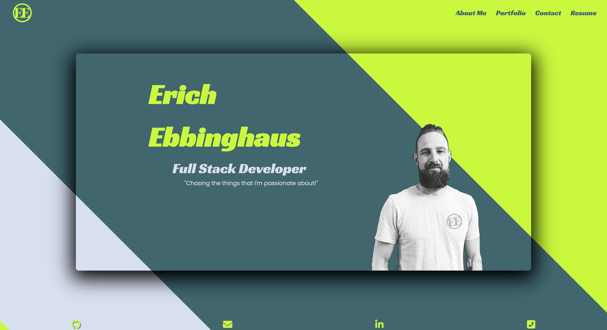

# React Portfolio

## Description

---

I created this portfolio with React to showcase my favorite projects, and to show my coding knowledge with real world examples of the things that i've learned.

This portfolio consists of four different sections. The about me section, my project section a contact section, and a resume and skills section. The links in the navigation section will direct you to the corresponding parts of the page. When you click on a link for a project in the projects section you will be directed to the github repository and can launch to the deployed site. The site has a responsive layout that will adapt to various different viewports.

---

## Screenshot

---

## Link to Deployed Application

<https://eebbinghaus.github.io/react-portfolio>
